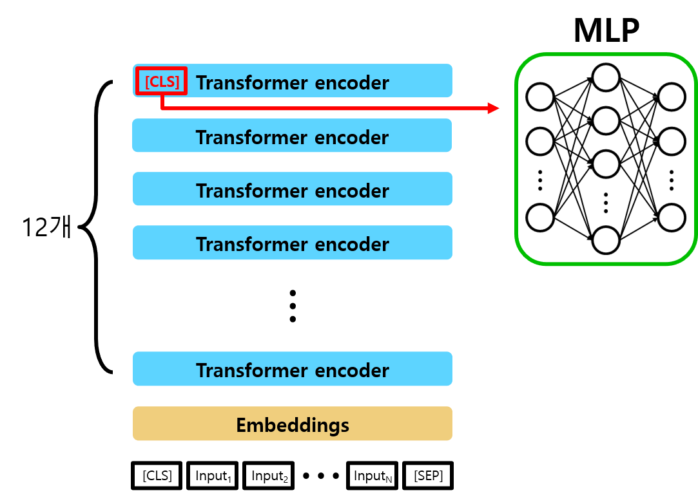
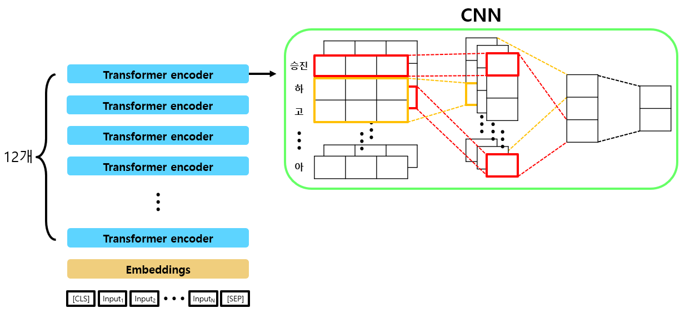
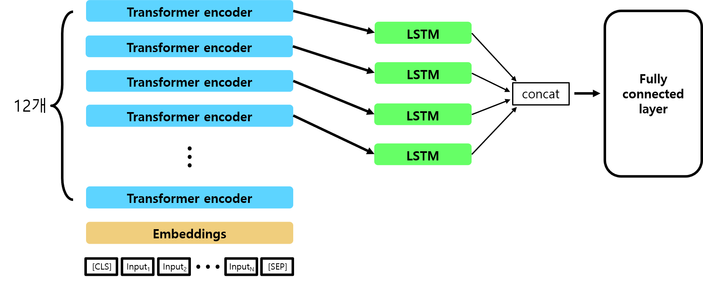
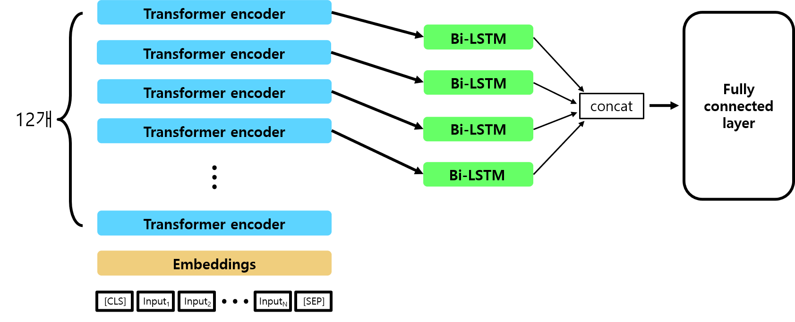
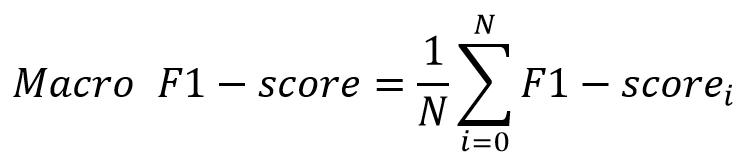

# 폭력 기반 한국어 텍스트 학습 및 분류 모델(2020 인공지능 그랜드 챌린지)

**본 프로젝트는 ETRI에서 제공된 한국어 korBERT 모델을 활용하여 폭력 기반 한국어 텍스트를 분류하는 다양한 분류 모델들을 제공합니다.**

본 개발자들이 참여한 [2020 인공지능 그랜드 챌린지](http://www.ai-challenge.kr/) 4차 대회는 인공지능 기술을 활용하여 다양한 지역사회의 국민생활 및 사회현안을 대응하는 과제입니다. 
그중 음성인지 트랙은 음성 클립에서 위협상황을 검출하고 해당 위협 상황을 구분하는 것이 목표로 하고 있습니다. 아래의 표는 본 대회에서 정의한 4가지의 폭력 Class이며 아래의 4가지 폭력 Class 외에 비폭력 Class가 추가되어 총 5개 Class의 폭력 또는 비폭력을 분류하는 것이 주된 목적입니다.

<b>< 음성인지 분류대상 정의 ></b>

**추가적으로, 본 개발자들은 ETRI에서 작성된 사용협약서에 준수하여 pretrained 모델 및 정보에 관한 내용은 공개하지 않습니다.** 해당 프로젝트를 쉽게 활용하기 위해서는 ETRI에서 제공하는 API를 활용하시면 되며, 다음 [링크](https://aiopen.etri.re.kr/key_main.php)에서 서약서를 작성 후 키와 코드를 다운받으시면 되십니다. 본 프로젝트는 대회에서 적용한 여러 분류 모델들을 제공하며 앞서 다운로드한 ETRI에서 제공된 형태소 분석기와 토큰화를 사용하여 쉽게 실습할 수 있습니다.

## 분류 모델

## Requirements

Python 3.7

Pytorch == 1.5.0

boto3

botocore

tqdm

requests

## Models

본 프로젝트는  4가지의 분류 모델(MLP, CNN, LSTM, Bi-LSTM)을 활용하였습니다. 아래는 활용된 모델들의 전체적인 시나리오를 보여주는 개요도입니다.

### 1. MLP

<b>< 활용된 MLP 모델 ></b>

### 2. CNN

CNN은 [해당 논문](https://arxiv.org/abs/1408.5882)을 참고하였습니다. 더 자세한 내용은 논문에서 확인할 수 있습니다. 

<b>< 활용된 CNN 모델 ></b>

### 3. LSTM

<b>< 활용된 LSTM 모델 ></b>

### 4. Bi-LSTM 

<b>< 활용된 Bi-LSTM 모델 ></b>

## Results

본 대회에서는 분류 결과를 Macro-F1 score에 의해 평가하였으며, Macro-F1 score는 아래와 같이 정의합니다. 이때, i는 각각의 폭력 및 비폭력 Class를 의미합니다.

<b>< Macro-F1 Score ></b>

위 식을 토대로, 저희의 분류 
아래의 결과는 2020 인공지능 그랜드 챌린지 4차 대회 음성인지 트랙에서 본 팀에 대한 결과이며, 주최 측에서 테스트 데이터는 공개하지 않아 확인할 수 없습니다.

| Model | MLP [1] | CNN [2] | LSTM [3] | Bi-LSTM [4] |
| :-----: | :-----: | :-----: | :-----: | :-----: |
| Macro F1-Score | 0.7029 | 0.615 | **0.7157** | 0.6935 |

## License

